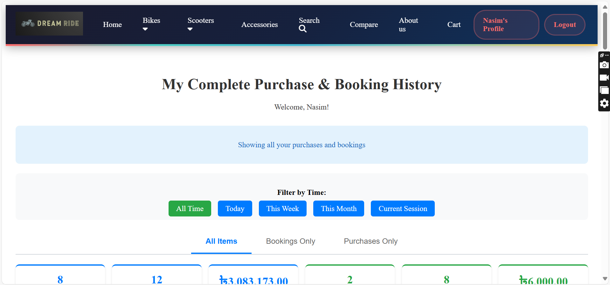
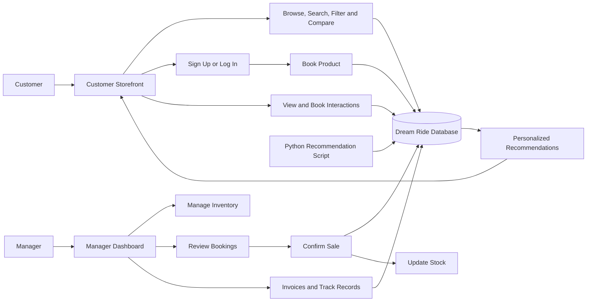

# Dynamic-Bike-Store-Management-System
<div align="center">
  

# Dream Ride — Dynamic Bike Store Management System

A complete web-based bike-store platform for browsing products, booking items, managing inventory, recording sales, generating invoices, and providing personalized product recommendations.

[](https://www.php.net/)
[](https://www.mysql.com/)
[](https://developer.mozilla.org/docs/Web/JavaScript)
[](https://www.python.org/)
[](#project-status)

[Features](#features) • [Screenshots](#screenshots) • [Installation](#installation) • [Usage](#usage) • [Database](#database-design)

</div>

---

## Overview

**Dream Ride** is a dynamic bike-store management system with two connected interfaces:

* A **customer storefront** for exploring bikes, scooters, helmets, and engine oils.
* A protected **manager dashboard** for inventory, bookings, customers, sales, invoices, and business records.

The project uses PHP and MySQL for the main application and includes a Python script that generates rule-based product recommendations from customer interaction history.

## Screenshots

| Customer product browsing and filters                              | Manager dashboard                                 |
| ------------------------------------------------------------------ | ------------------------------------------------- |
|  |  |

| Customer cart                                | Purchase and booking history                    |
| -------------------------------------------- | ----------------------------------------------- |
|  |  |

More screenshots are available in [`Support/SS`](Support/SS). A recorded demonstration is available at [`Data/Dreamride2.mp4`](Data/Dreamride2.mp4).

## Features

### Customer side

* Browse bikes, scooters, helmets, and engine oils.
* View products by category or brand.
* Search across product names, companies, and product types.
* Filter products by category, brand, and price range.
* View product images, prices, stock, engine details, mileage, and release year.
* Compare up to **three products** side by side.
* Create an account and log in securely using hashed passwords.
* Book available products with quantity validation.
* View the current cart and cancel an active booking.
* Review complete booking and purchase history.
* Filter history by today, this week, this month, current session, or all time.
* View personal account details and change the account password.
* Receive product recommendations based on browsing and booking activity.

### Manager side

* Protected manager login and session-based access control.
* Dashboard summaries for total bookings, booking value, sales, and sales value.
* Filter dashboard statistics by overall, last week, last month, or last year.
* Add bikes, scooters, helmets, and engine oils.
* View, update, and delete inventory records.
* View registered customers and active bookings.
* Convert a booking into a completed sale.
* Automatically reduce available stock after a sale.
* Remove completed bookings after sale confirmation.
* View sold-product records.
* Search sales and generate printable customer invoices.
* Filter booking and sales records by date range.
* Produce printer-friendly track-record reports.

## Technology Stack

| Layer                    | Technology                                               |
| ------------------------ | -------------------------------------------------------- |
| Frontend                 | HTML5, CSS3, JavaScript                                  |
| Backend                  | PHP 8+                                                   |
| Database                 | MySQL / MariaDB                                          |
| Authentication           | PHP sessions and `password_hash()` / `password_verify()` |
| Recommendation component | Python, pandas, MySQL Connector/Python                   |
| Local development        | XAMPP, WAMP, MAMP, or a compatible PHP/MySQL server      |
| Development environment  | Visual Studio Code                                       |

## System Workflow



## Database Design

The SQL dump is located at [`Data/dreamride.sql`](Data/dreamride.sql). It creates the `dreamride` database structure and provides sample records.

### Main tables

| Table                      | Purpose                                          |
| -------------------------- | ------------------------------------------------ |
| `product`                  | Central product identity and category data       |
| `bike`                     | Bike specifications, price, stock, and images    |
| `scooter`                  | Scooter specifications, price, stock, and images |
| `helmet`                   | Helmet inventory data                            |
| `engine_oil`               | Engine-oil inventory data                        |
| `signup`                   | Registered customer accounts                     |
| `booked`                   | Active customer bookings                         |
| `sell`                     | Completed sales records                          |
| `user_product_interaction` | Product-view and booking activity                |
| `product_recommendations`  | Generated recommendations for each customer      |

The database also creates views for booked products, sold products, and category-specific inventory reporting.


A PDF version of the ERD is available at [`Data/Dream-RideERD.drawio-1.pdf`](Data/Dream-RideERD.drawio-1.pdf).

## Project Structure

```text
Dynamic-Bike-Store-Management-System/
├── Data/
│   ├── dreamride.sql
│   ├── DreamRide Schema.jfif
│   ├── Dream-RideERD.drawio-1.pdf
│   └── Dreamride2.mp4
├── Support/
│   ├── Manager/
│   │   ├── Image/
│   │   ├── css/
│   │   └── php+js/
│   ├── User/
│   │   ├── Images/
│   │   ├── css/
│   │   └── php+js/
│   └── SS/
├── others/
│   └── Project reports, presentations, and progress documents
├── requirements.txt
└── README.md
```

## Requirements

Install or enable the following before running the project:

* Apache or another PHP-compatible web server
* PHP **8.0 or newer**
* MySQL or MariaDB
* phpMyAdmin, MySQL Workbench, or another SQL import tool
* Python **3.9 or newer** for the recommendation component
* `pandas` and `mysql-connector-python` for the Python script

> PHP 8+ is required because the application uses functions such as `str_contains()`.

## Installation

### 1. Clone the repository

```bash
git clone https://github.com/MunamRahman/Dynamic-Bike-Store-Management-System.git
```

For XAMPP, place or clone the project inside the `htdocs` directory:

```text
C:\xampp\htdocs\Dynamic-Bike-Store-Management-System
```

### 2. Start the local services

Open the XAMPP or WAMP control panel and start:

* Apache
* MySQL

### 3. Create and import the database

1. Open http://localhost/phpmyadmin.
2. Create a database named `dreamride`.
3. Select the database and open the **Import** tab.
4. Import [`Data/dreamride.sql`](Data/dreamride.sql).

The dump includes the required tables, relationships, views, and sample data.

### 4. Configure the database connection

The current local configuration uses:

```php
$server = "localhost";
$username = "root";
$password = "";
$database_name = "dreamride";
```

Update these two files when your MySQL credentials are different:

```text
Support/User/php+js/connection.php
Support/Manager/php+js/connection.php
```

### 5. Install Python dependencies

```bash
python -m pip install pandas mysql-connector-python
```

Ensure the database settings in the following file match your MySQL configuration:

```text
Support/User/php+js/recommendations.py
```

### 6. Generate recommendations

After customers have created interaction data by viewing or booking products, run:

```bash
python Support/User/php+js/recommendations.py
```

The script excludes previously viewed or booked products, looks for products near the customer's average interacted price, considers preferred companies, and writes up to four recommendations to the database.

For continuous updates, run this script periodically through Task Scheduler or a cron job.

## Running the Application

### Customer storefront

```text
http://localhost/Dynamic-Bike-Store-Management-System/Support/User/php+js/index.php
```

### Manager dashboard

```text
http://localhost/Dynamic-Bike-Store-Management-System/Support/Manager/php+js/login.php
```

### Development manager credentials

```text
Email: admin@dreamride.com
Password: 0123456789
```

> These credentials are hardcoded for local demonstration. Change the manager authentication system before publishing or deploying the application.

## Usage

### Customer workflow

1. Open the customer storefront.
2. Browse or search for a product.
3. Use brand, category, or price filters when needed.
4. Open a product to review its details.
5. Sign up or log in.
6. Select an available quantity and book the product.
7. Review or cancel the booking from the cart.
8. Check completed purchases and bookings from the profile history page.

### Manager workflow

1. Log in to the manager dashboard.
2. Add or update inventory records.
3. Review customer and booking information.
4. Confirm a booked item as sold.
5. Verify that inventory quantity is reduced automatically.
6. Search sales and print an invoice.
7. Review date-filtered booking and sales reports.

## Recommendation Logic

The recommendation component is a rule-based personalized recommender:

1. Customer product views and bookings are saved in `user_product_interaction`.
2. Already-interacted products are removed from the candidate list.
3. The script calculates the customer's average interacted product price.
4. Products within approximately **৳50,000** of that average are prioritized.
5. Products from previously viewed companies are also considered.
6. Remaining positions are filled using the closest available product prices.
7. The selected product IDs are stored in `product_recommendations` and displayed on the customer homepage.

## Security Notes

This repository is suitable for learning and local demonstration. Before production deployment:

* Move database and manager credentials into environment variables.
* Replace the hardcoded manager account with database-backed authentication.
* Add CSRF protection to forms.
* Validate and allow-list all table and category values used in dynamic queries.
* Use database transactions when confirming a sale and updating stock.
* Add login throttling, secure cookie settings, and stronger authorization checks.
* Remove or anonymize sample customer data from public SQL dumps.
* Disable detailed database errors in production.

## Validation

All PHP files in the repository can be checked from the project root with:

```bash
find Support -type f -name "*.php" -print0 | xargs -0 -n1 php -l
```

The repository's current PHP files pass PHP syntax validation.

## Project Status

The main academic project implementation is complete and includes customer, manager, database, reporting, and recommendation modules. It is best treated as a local or educational application until the production security improvements above are implemented.

## Roadmap

* Move configuration values to a `.env` file.
* Add database-backed roles and manager accounts.
* Automate recommendation generation.
* Add PHPUnit and browser-based tests.
* Use database transactions for booking-to-sale conversion.
* Add pagination for products, customers, bookings, and sales.
* Improve mobile responsiveness and accessibility.
* Add deployment instructions for a hosted Linux server.

## Contributing

Contributions are welcome.

1. Fork the repository.

2. Create a feature branch:

   ```bash
   git checkout -b feature/your-feature-name
   ```

3. Commit your changes:

   ```bash
   git commit -m "Add your feature"
   ```

4. Push the branch:

   ```bash
   git push origin feature/your-feature-name
   ```

5. Open a pull request.

## Author

**Munam Rahman**
GitHub: [@MunamRahman](https://github.com/MunamRahman)

## License

This repository does not currently contain a `LICENSE` file. Add an appropriate open-source license before permitting third-party reuse or distribution.

---

<div align="center">
  Built for a smoother bike-store browsing and management experience.
</div>
